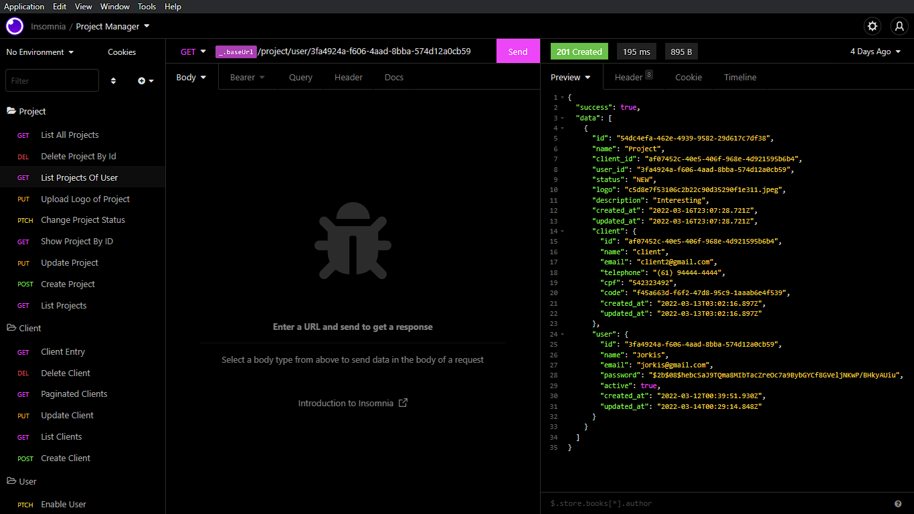

# - ProjectManager - API -

## Demo 📸

 

## Application deploy with Heroku: :dash:

> https://project-manager-wsl.herokuapp.com/docs/

## 📖 About the Project

ProjectManager-API - This is a project manager build with Node.js, TypeORM and PostgreSQL.

## 📗 Features

| Feature  |  Coded?       | Description  |
|----------|:-------------:|:-------------|
| Create user | &#10004; | Ability to create a user (dev) |
| Enable user | &#10004; | Ability to enable a user |
| Login user | &#10004; | Ability to login user |
| Create client | &#10004; | Ability to create client |
| List all clients | &#10004; | Ability to list all clients |
| List client by name | &#10004; | Ability to list client filtered by name |
| Update client | &#10004; | Ability to update informations about client |
| List clients with pagination | &#10004; | Ability to see all clients in pagination |
| Delete client | &#10004; | Ability to delete a client |
| Send email with code on create client | &#10004; | Ability to send email with code on create client |
| Client can entry with code and see project data. | &#10004; | Ability to client entry in project |
| Create project | &#10004; | Ability to create project |
| List projects | &#10004; | Ability to list all projects |
| Show project by id | &#10004; | Ability to search project by id |
| Change project status | &#10004; | Ability to change project status |
| Upload Logo of Project. | &#10004; | Ability to upload logo of project |
| List projects of User. | &#10004; | Ability to list projects of user |
| Delete Project | &#10004; | Ability to delete project by id |

## 🛠 Technologies

<li><a href="https://nodejs.org/en/">Node.js</a></li>
<li><a href="Typescriptlang.org">Typescript</a></li>
<li><a href="https://typeorm.io/#/">TypeORM</a></li>
<li><a href="https://www.postgresql.org">PostgreSQL</a></li>
<li><a href="https://expressjs.com">Express.js</a></li>
<li><a href="https://www.npmjs.com/package/multer">Multer</a></li>
<li><a href="https://jwt.io">JWT</a></li>
<li><a href="https://www.npmjs.com/package/ts-node-dev">ts-node-dev</a></li>
<li><a href="https://www.npmjs.com/package/bcryptjs">Bcryptjs</a></li>
<li><a href="Swagger.io">Swagger</a></li>
<li><a href="https://eslint.org">Eslint</a></li>
<li><a href="https://prettier.io">Prettier</a></li>
<li><a href="https://editorconfig.org">EditorConfig</a></li>

## 💻 How to run the application

#### Pre-requisites:
You must have the tools installed:  <a href="">Git</a>, <a href="">Node.js</a>, <a href="">PotsgreSQL</a> And create a new file called: .env, that follow .env.example credencials.

<pre>
# In the terminal, clone the project:
$ git clone https://github.com/Wesley-wsl/ProjectManager-api.git

# Enter the project folder:
$ cd ProjectManager-api

# Install dependencies:
$ yarn
or
$ npm install

# Build the application:
$ yarn build
or
$ npm run build

# Run the application:
$ yarn start
or
$ npm run start
</pre>

Okay, now you can access the application from the route:  <a href="https://localhost:3333/docs">https://localhost:3333/docs</a>
